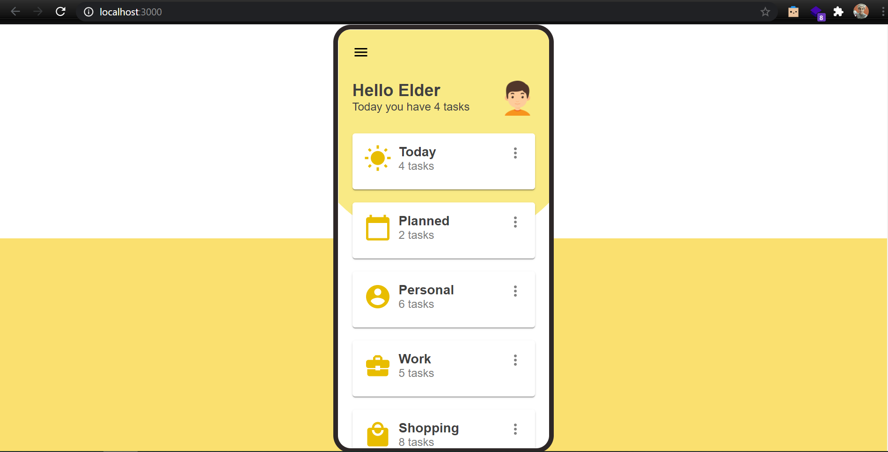
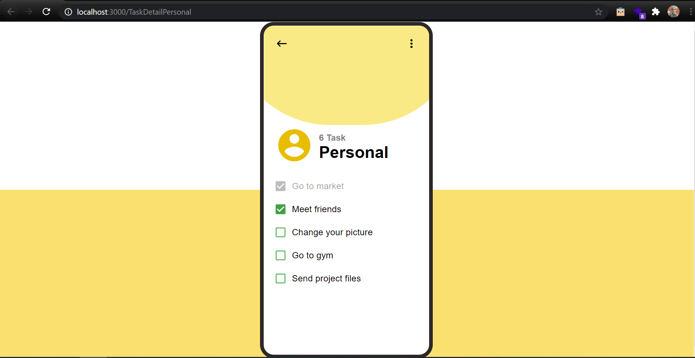

# Todo

A modern todo web application. 

## Home Page

## Tasks Page

## Getting Started (try it out) 

1. `git clone https://github.com/imkaka/todo.git`
2. `cd todo`
3. `npm install`
4. `npm run start`

That's it, Happy Coding! :tada:
